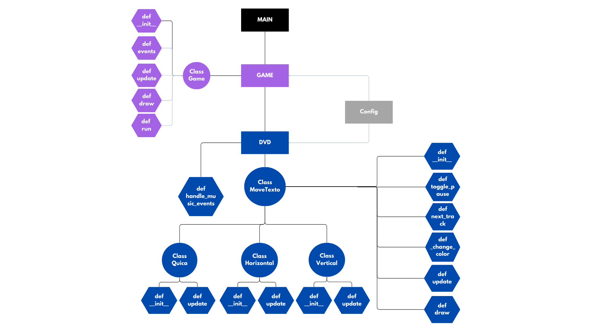

# Projeto: DVD Bounce em Pygame

## Descrição
Este projeto implementa um simulador de movimento de texto semelhante ao clássico DVD screensaver, utilizando a biblioteca Pygame. O texto quica nas bordas da tela, mudando de cor ao colidir. Além disso, há suporte para efeitos sonoros e reprodução de música.

## Diagrama UML



## Tecnologias Utilizadas
- **Python** 3.x
- **Pygame** para renderização gráfica e manipulação de áudio

## Estrutura do Código

O código segue os princípios do **SOLID** e **Clean Code**, garantindo legibilidade, reutilização e fácil manutenção.

### SOLID Principles Aplicados

1. **Single Responsibility Principle (SRP)**
   - Cada classe tem uma única responsabilidade.
   - `MoveTexto` gerencia o movimento e cor do texto.
   - `handle_music_events` lida com eventos de música separadamente.
   
2. **Open/Closed Principle (OCP)**
   - As classes podem ser estendidas sem modificação.
   - `MoveTexto` serve como base para `Quica`, `Vertical` e `Horizontal`, que personalizam o comportamento sem alterar a classe base.

3. **Liskov Substitution Principle (LSP)**
   - As classes derivadas (`Quica`, `Vertical`, `Horizontal`) podem substituir `MoveTexto` sem impactar o funcionamento.

4. **Interface Segregation Principle (ISP)**
   - Cada classe implementa apenas os métodos necessários.
   - Exemplo: `Vertical` e `Horizontal` sobrescrevem apenas `update`, sem carregar funcionalidades desnecessárias.

5. **Dependency Inversion Principle (DIP)**
   - O código depende de abstrações e configurações externas (`config.py`), facilitando mudanças.

### Clean Code Aplicado

- **Nomes Significativos**: Métodos e classes possuem nomes descritivos (`update`, `draw`, `toggle_pause`).
- **Modularização**: Código dividido em classes especializadas.
- **Evita Código Duplicado**: Métodos reutilizáveis, como `_change_color`.
- **Comentários e Docstrings**: Cada classe e método possuem documentação clara.

## Como Executar
1. Instale as dependências:
   ```bash
   pip install pygame
   ```
2. Execute o script principal:
   ```bash
   python main.py
   ```

## Controles
- `Espaço`: Pausar/Retomar a música
- `S`: Alternar para a próxima faixa

